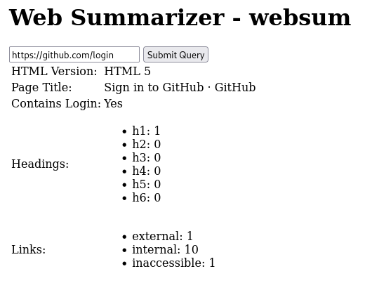

# Web Summarizer - websum
Provides General Information about the content of the page from URL

## Data Provided:
- ### HTML Version
Cover HTML versions based on [this reference](https://howtocheckversion.com/check-html-version-website/) by finding whether the HTML contains the related key or not.
- ### Page Title
Using the `title` HTML tag to get the Page Title directly.
- ### Headings count by level
Finds all h1 to h6 HTML tags and count each of them.
- ### Amount of internal and external links
Finds `a` HTML tag and check if it does not contains domain, means it's a direct internal link and counts as internal links. if it contains domain and the domains is the same as requested url, it counts as internal links. otherwise it counts as external links.
- ### Amount of inaccessable links
if link cannot be access using HTTP GET method, returning an error or the HTTP status is not `200`. it counts as inaccessable links.
- ### If page contains a login form
find input that has `type="password"`. but login and register have the same input type for password. it finds input `type="submit"` and `button` HTML tag  that contains words login, log in, or sign in in order to verify whether the page contains a login form or not.

### How to run example:
```
cd example && go run main.go
```

### How to access example:
use browser and access `localhost:9000`

### Result:
